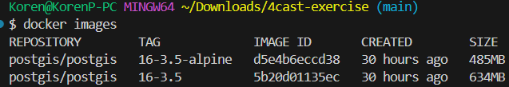

# 4cast-exercise

Creating predefined postgres docker containers is not recommended and that the recommended way is mounting a migration file to the /docker-entrypoint-initdb.d directory.

If it was a complex system using bitnami image as base image which makes everything more configurable and easy to use in kubernetes/openshift environment and have an official supported postgres helm chart. which i have contributed in the past. https://github.com/bitnami/charts/pull/27734

I chose using postgres image with 16.6-alpine tag because it reduces image size while using alpine linux distribution. you can use even smaller distroless images for more reduced image size but i wanted to maintain official support of postgres and alpine images.

For the Dockerfile i used multistage building that in the first stage im "compiling" the new psql file with pg_restore command and in for the next stage im copying the new gis_world_db.psql file to the /docker-entrypoint-initdb.d directory which runs it in the first setup of the postgres which called migrations.

Im adding screenshot of the difference in size of regular postgres image and alpine based image.

Also adding screenshot of the building process.

